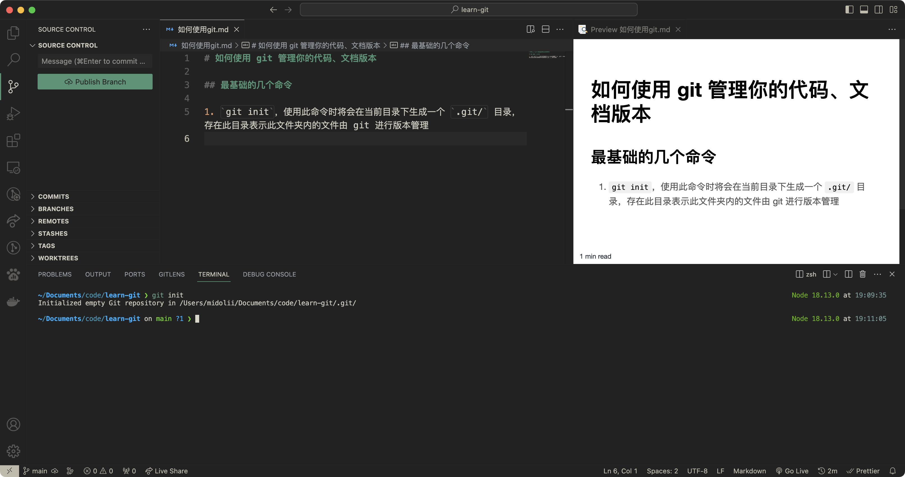
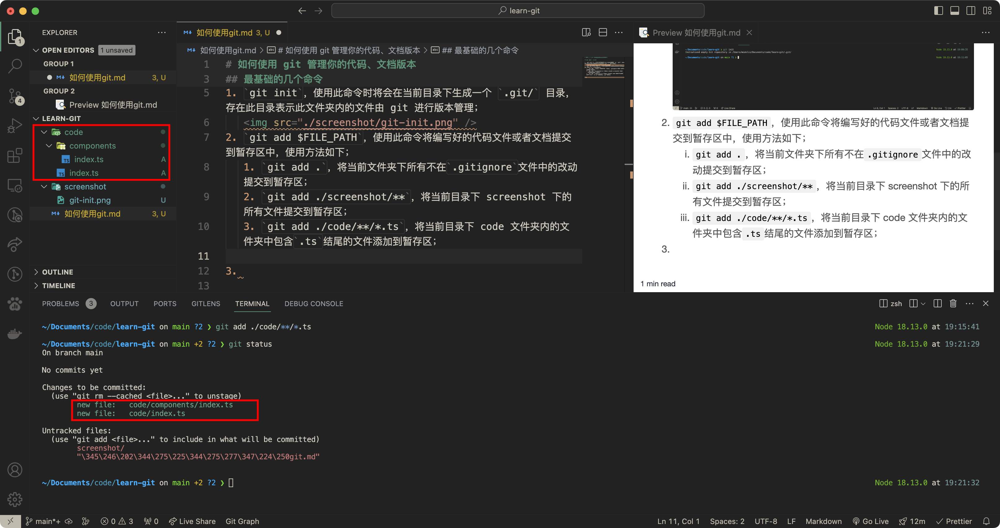
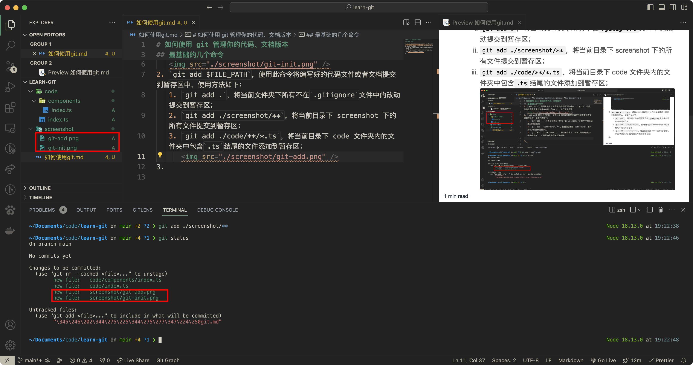
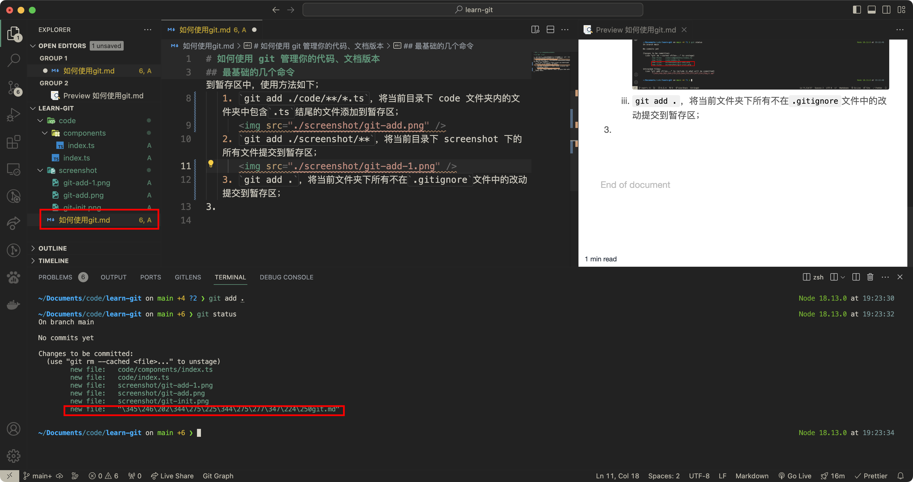
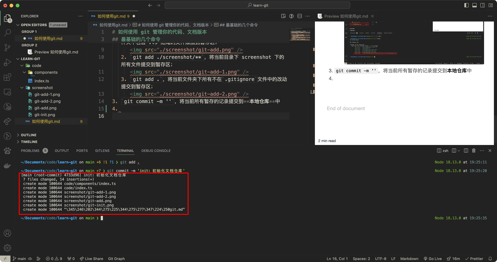
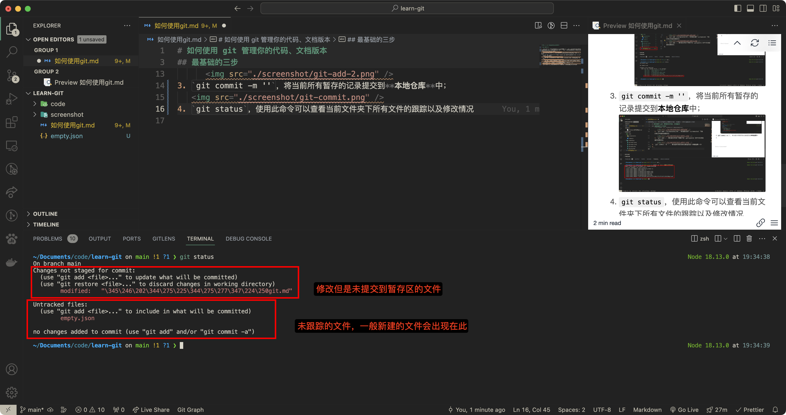
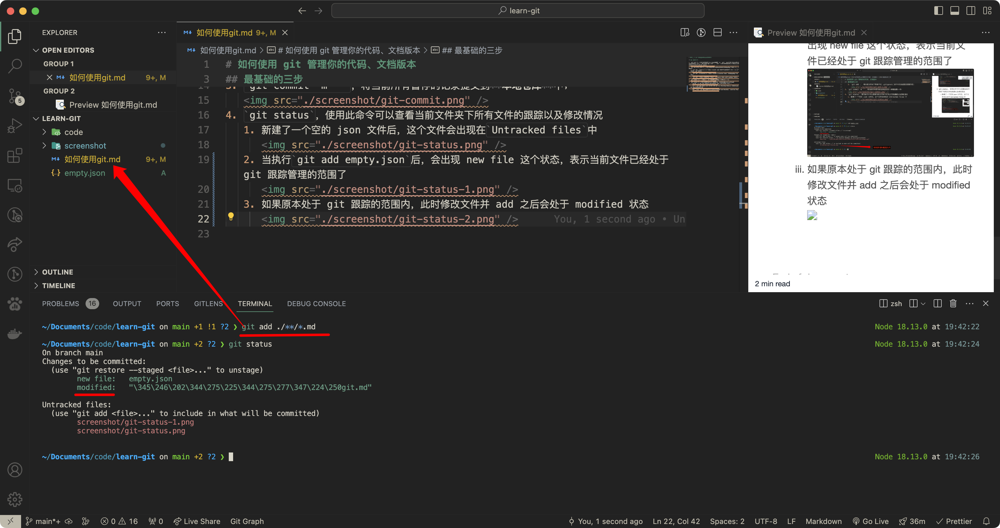
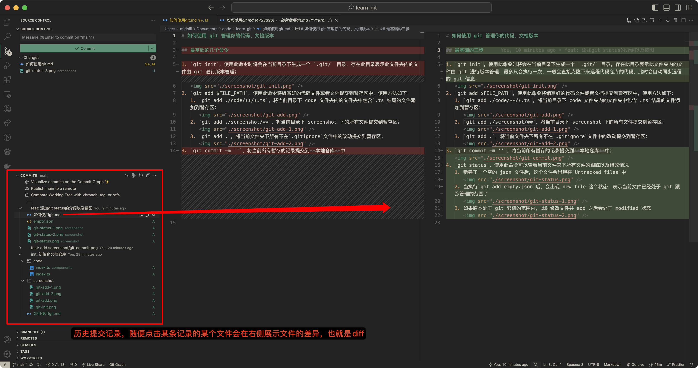
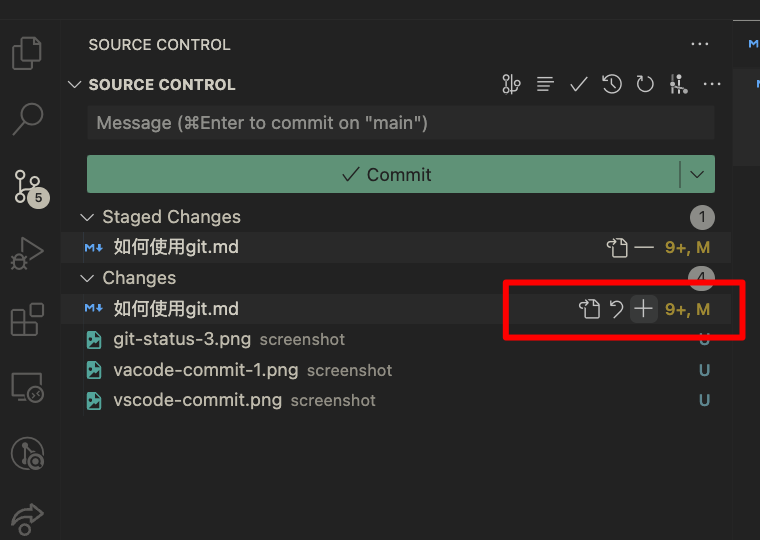

# 如何使用 git 管理你的代码、文档版本

> 此文档暂不涉及分支的操作

## 基础操作

1. `git init`，使用此命令时将会在当前目录下生成一个 `.git/` 目录，存在此目录表示此文件夹内的文件由 git 进行版本管理，最多只会执行一次，一般会直接克隆下来远程代码仓库的代码，此时会自动同步远程的 git 信息；
   
2. `git add $FILE_PATH`，使用此命令将编写好的代码文件或者文档提交到暂存区中，使用方法如下；
   1. `git add ./code/**/*.ts`，将当前目录下 code 文件夹内的文件夹中包含`.ts`结尾的文件添加到暂存区；
      
   2. `git add ./screenshot/**`，将当前目录下 screenshot 下的所有文件提交到暂存区；
      
   3. `git add .`，将当前文件夹下所有不在`.gitignore`文件中的改动提交到暂存区；
      
3. `git commit -m ''`，将当前所有暂存的记录提交到**本地仓库**中；
   
4. `git status`，使用此命令可以查看当前文件夹下所有文件的跟踪以及修改情况
   1. 新建了一个空的 json 文件后，这个文件会出现在`Untracked files`中
      
   2. 当执行`git add empty.json`后，会出现 new file 这个状态，表示当前文件已经处于 git 跟踪管理的范围了
      
   3. 如果原本处于 git 跟踪的范围内，此时修改文件并 add 之后会处于 modified 状态
      
   4. 如果当前什么修改都没有（或者把修改全部 commit），暂存区是干净的
      

## 查看历史版本

1. `git reflog`
2. 使用 vscode 侧边的`source control`更加清晰
   
3. 可以查看当前工作区
   
4. 可以操作当前工作区文件，**从右至左**依次为，
   1. 将文件添加至 Staged Changes 中，即`git add`
   2. 撤销文件的所有本次修改（慎用，会丢失本次修改过的内容）
   3. 查看原始文件内容（正常点击某一条记录会展示 diff，即文件修改的内容，所以给出了一个查看原始文件的按钮）
      

## 日常使用时

- 【简单粗暴】每次保存文件的时候执行下方两个命令即可

```bash
git add .
git commit -m 'message'
```

- 也可以每次提交针对每一个文件单独 add，单独 commit

```bash
git add file1
git commit -m 'file1新增了xxx模块'

git add file2
git commit -m '修复了某个bug'
```
